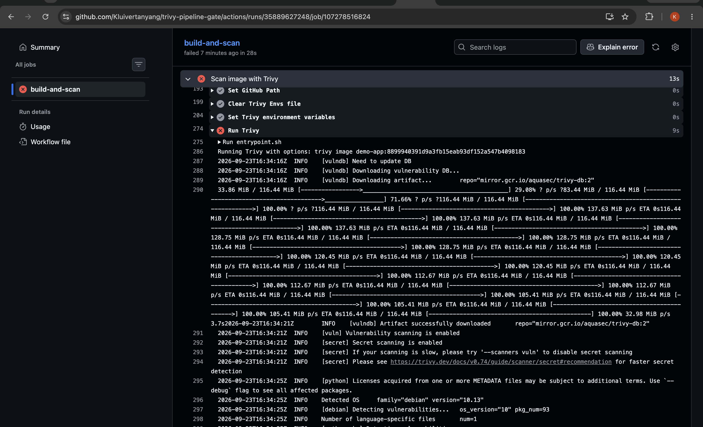
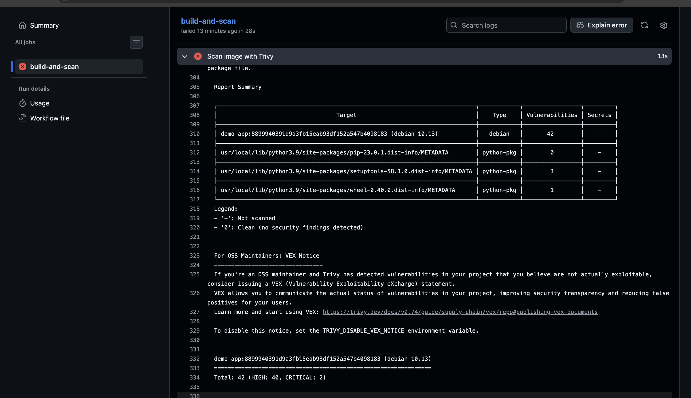
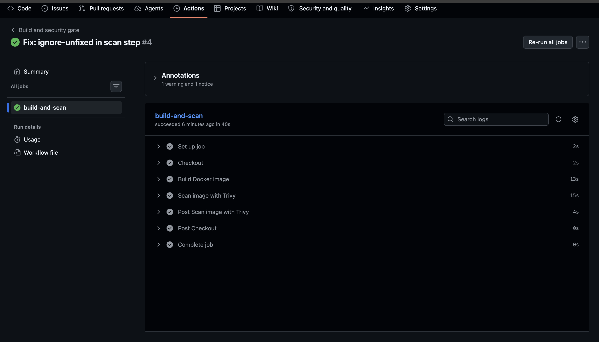

# trivy-pipeline-gate

Most teams scan container images after deploy. That's forensics, not prevention.

## The problem

Image scanning usually happens too late after the image is in the registry, or already running. By the time the CVE report lands, you're writing an incident report instead of preventing one.

## What I built

A GitHub Actions pipeline with a hard security gate:

1. **Build** the Docker image on every push to `main`
2. **Scan** it with [Trivy](https://github.com/aquasecurity/trivy) via `aquasecurity/trivy-action`
3. **Fail the build** (`exit-code: 1`) on any CRITICAL or HIGH CVE — the image never reaches a registry

I proved the gate works by shipping a deliberately vulnerable image first (`python:3.9-slim-buster`), watching it fail, then fixing it with a base-image bump to `python:3.12-slim`.

## The gate fought back (and got better)

The bumped image *still* failed. No base image on earth could pass; re-pulling changed nothing. Weakening the severity list would have been cheating the gate.
So instead I set `ignore-unfixed: true`: the gate now fails only on CVEs that actually have a fix available. A gate that blocks you on the unfixable gets ignored; a gate that blocks only on what you can fix gets respected.

## See it work

### 1. The gate says no

The build step passes, the Trivy scan step fails, the run goes red. The vulnerable image goes nowhere.

### 2. The evidence

Trivy's table output against the old base image — CRITICAL and HIGH CVEs in Debian buster packages.

### 3. The fix: bump the base image, go green

Base-image bump (`python:3.9-slim-buster` → `python:3.12-slim`) plus the `ignore-unfixed` tuning, and the pipeline is green. Same app, no code changes, architectural fix.

## For Production Level i would ..

This works as a demo, but if I were running it for a real team there are three things I'd change:

- **Pin the action version.** `@master` moves under my feet so that my pipeline can't behaves differently with zero changes on my end. 
- **Send the results to the Security tab.** Right now the findings live in a workflow log nobody will ever open again. A SARIF upload turns them into tracked findings with history open, fixed, dismissed with a reason. Logs get ignored; dashboards get owned.
- **Rescan the registry on a schedule.** The gate only sees images at build time, but new CVEs can get disclosed every day against stuff i already shipped. A nightly rescan is the backstop. 